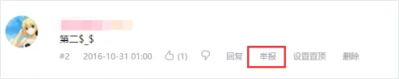
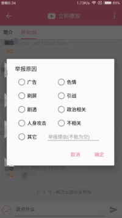

!!! summary "信息"

    ```YAML
    标题: 社区规则
    url:
        - https://www.bilibili.com/blackboard/blackroom.html
    存档时间: 2022-01-23
    ```

## 文字版

### “九不准”原则

bilibili严格遵守我国政府颁布的《互联网信息服务管理办法》第十五条规定，并将此作为bilibili平台运行的基本准则；
对于含有以下内容的信息，我们将采用最严格的管理办法，予以杜绝：

1. 反对宪法所确定的基本原则的；
2. 危害国家安全，泄露国家秘密，颠覆国家政权，破坏国家统一的；
3. 损害国家荣誉和利益的；
4. 煽动民族仇恨、民族歧视，破坏民族团结的；
5. 破坏国家宗教政策，宣扬邪教和封建迷信的；
6. 散布谣言，扰乱社会秩序，破坏社会稳定的；
7. 散布淫秽、色情、赌博、暴力、凶恶、恐怖或者教唆犯罪的；
8. 侮辱或者诽谤他人，侵害他们合法权益的；
9. 含有法律、行政法规禁止的其他内容的。

### 违禁内容

bilibili创建的目的，并不是向您提供个人的私密视频空间。因此，在视频投稿的过程中，请遵守当地相关法律，切勿上传含有色情或性暴露内容的视频，同理，含有反动、宗教、政治敏感性等其他违反国家相关法律内容的视频，同样是禁止上传的。

以下是一些可以帮到您的常识性规则。

请严肃对待这些规则，理解并尊重这些规则背后的精神。

如有发现任何规则漏洞请及时与我们取得联系，并不要试图投机取巧借此进行不正当的规避。

#### 1.关于裸露和色情内容

如果视频具有性暗示的意味，则不会被bilibili所接受。我们不允许露骨内容，如色情描写。含有怪癖内容的视频，将会被删除或施加限制，具体取决于行为的严重程度。

例外

如果包含裸露的视频是用于教育、纪实、科学研究或艺术用途，而不是毫无意义地展示图片，那么该视频是可以接受的。您可以在标题或者简介中提供背景和说明，将有助于bilibili的审核人员确定视频的主要用途。

禁止在评论、弹幕、签名等用户可编辑发布的内容里，发送与色情内容有关的第三方网址、社交账号、网盘代码等的垃圾广告信息，一经发现，我门将对发此类垃圾信息的账号永久封禁。

#### 2.关于暴力、有危害性或危险性内容

我们将“有危害性或危险性内容”界定为：有意煽动暴力、怂恿他人参与、或向他人展示可能会造成人身伤害、或导致死亡的危险、或违法活动的内容。

禁止发布含有暴力、血腥、以及一些含有骇人成分内容的视频。如果视频本身为新闻或纪录片，请提供能够清楚解释此类内容画面发生背景的说明，避免对观众用户造成不必要的困扰。

请勿鼓励他人进行暴力活动。

bilibili禁止发布煽动他人实施暴力行为的视频。如果您的视频唆使他人实施暴力行为、或凭借严重的暴力行为威胁其他人，我门将不会通过该视频上线。

视频中若有怂恿危险、或违法活动的内容，包括自制炸弹等危险品的说明、使用毒品等违禁品、或其他可能造成严重伤害的行为，我们认为此类视频有害，将不会通过该视频上线、或删除该视频。

若视频中有危险行为画面，但其主要目的是为了教育、纪实、科学研究所用，则此类内容可以接受。例如，介绍打击毒品行为的纪实作品，但是，如果脱离所发布的新闻/纪实内容的完整版本，单独发布其中的部分片段，就将被视为不适当内容。

特别提醒：危险组织

我们不允许任何参与以下活动的组织或者内容，在bilibili上展示或者发布：恐怖活动、或有组织的犯罪活动；我们还会删除对上述暴力或犯罪活动表示支持的视频、图文内容；我们也不允许支持或赞扬上述组织的领导者、或者纵容他们的暴力活动。

此外，我们在决定对视频不予通过、删除或者施加限制时，所考虑的因素还包括：

+ 视频内容所涉及的行为，是否会导致严重的伤害或死亡；
+ 实施行为的个人是否收到过专业培训，并采取了一切必要的预防措施防止受到伤害；
+ 这些行为是否会被未成年人轻易模仿；
+ 视频内容是否会被用于实施严重的暴力活动；

特别提醒：自残行为

bilibili禁止宣传自残或自杀行为。

我们禁止发布（点播/直播）宣传/鼓励自杀、或其他任何类型的自残行为的内容，包括自我毁伤和饮食失调，但整容整形并不属于自残行为。我们还会移除严肃或讽刺地展示和抨击，自残或自杀受害者或幸存者的内容。

#### 3.个人隐私

涉嫌跟踪、威胁、骚扰、胁迫、侵犯用户个人隐私、披露用户个人信息等，以及违反上述和其他规则的行为，将受到严肃处理。对于情节严重的用户，我们将永久禁止其登录网站和客户端。

#### 4.恶意冒充他人

不要通过自己的账号信息（昵称、头像、签名、个人空间等），恶意模仿本站的特定用户，并伪装成模仿的对象与他人进行互动；同时，伪装成涉及官方业务的账号，同样也是不允许的，容易对其他用户造成一定的误导。

特别提醒：欺诈、诈骗等行为

一些用户企图通过创建的内容欺骗他人，为自己谋取经济利益，我们会删除这些故意误导用户的内容，在某些情况下可能会对上传者发出警示。

我们对于敲诈和/或勒索行为采取零容忍政策，如果有人录制/发布了会威胁到您个人隐私的视频，请立即举报，我们会在核实后将其移除，并与当地执法部门联系。

#### 5.人身攻击

bilibili希望为广大用户营造和维护健康、积极向上的互动型社区氛围。鼓励各位用户在视频、弹幕和评论中，发表个人的意见和观点，但发表的内容不应包含涉及种族、宗教信仰、性别、年龄、国籍、残障、性取向等，真对特定对象或群体的语言人身攻击，禁止藉由以上内容煽动对立、仇恨情绪。

请不要对任何个人或群体进行嘲讽、发布仇恨言论、挑拨他人矛盾。威胁他人的用户账户经查证后会收到警告，情节严重的账户会被封停。

#### 6.垃圾内容

请不要恶意使用弹幕、评论和私信功能，发布重复的、无目的或令人厌恶的内容。请不要为了提高视频的相关数据，上传与和视频内容无关的误导性的标题、简介、标签或缩略图，这些将被视为“垃圾内容”，而所发布的视频也将被限制、或者从网站上移除。

我们对于“垃圾内容”的界定：

无关人名/无意义语句、符号/无意义时间/番剧中刷其他番剧/恶俗空耳/针对不同观点的对象无脑嘲讽/添加与视频内容无关的标签/添加剧透视频内容的标签/添加广告、色情、引战、政治相关内容标签/删除他人视频正确的标签等等。

此外，任何使用自动系统、或者为不知情的观看者提供视频，来人为增加观看次数、顶的次数、评论数量或其他指标的行为，很可能将被我们界定为“垃圾流量”。如果发现有视频和账户违反了该条款，我们会关闭相关账户，并将视频从哔哩哔哩上移除。

### 用户账号使用规范

用户信息，是您在bilibili上的一张“身份证”，它包括了账号信息（头像/昵称/签名/个人标签）、以及空间信息（头图/收藏夹/个人公告/推荐理由/频道标题）。用户在使用自定义功能、个性化自己的信息时，请遵守国家相关法律、法规，不得在具体内容中含有违禁信息，违规账号信息以及空间信息，将被屏蔽甚至封禁。

#### 盗用账号

不得以任意手段，窃取并盗用他人的哔哩哔哩账号。若在非法登陆的情况下，该账号所发布的一切内容都将视为垃圾信息，对稿件产生的点击、硬币、收藏等数量的增长将视为垃圾流量，发现并确认后将一并删除。

特别提醒

切勿将自己的账号用户名及密码告诉他人。一旦发生账号被他人盗用，您的账号可能在短时间内会被限制各功能使用权限，并需要重新绑定认证。

### 投稿规范

由于网站各分区内容的不同，各个分区的审核标准和尺度也有一定的区别，希望各位用户能够理解这种区别的存在。详细的分区介绍或规范请点击查看[^bb6_716]

[^bb6_716]:
    [旧版分区规则](../帮助中心/旧版/投稿•视频管理/了解分区.md)、[新版分区规则](../帮助中心/新版/分区投稿规则/分区规范.md)。

#### 1.拒绝“标题党”

bilibili拒绝各种类型的“标题党”。

对于故意用较为夸张、耸动的标题、图片或者标签，来吸引用户点击观看视频的行为，我们将予以屏蔽、下架、甚至删除处罚。

##### 封面图

封面图内容应与视频主体内容一致、或为视频内容的截图；若封面与视频主体内容，存在过大偏差，则将会被自动替换成稿件中视频的随机截图。

封面图不能使用动态图片。

##### 标题

请勿填写无意义的、与视频内容完全无关、甚至具有挑衅、煽动、或引战性质的标题，我们将删除

##### 标签（tag）

为了方便投稿能够被用户正确搜索，请填写与视频内容相关的标签，包括但不限于视频中涉及的人物、团体、概念、视频本身的属性等。请不要填写与视频内容没有直接联系或者无意义的标签内容。

#### 2.其他投稿规则

##### 标题其他

禁止在标题中出现画质/音质测试及相关文字。

根据相关公告，标题请尽可能使用中、英文填写。

投稿标题请尽量用中文填写并尽可能使用常见的翻译，建议将原标题请填写在简介中；人名、团体/组织名等不可翻译的专有名词以官方形式为准，可以不予翻译。

部分分区存在标题格式的要求，填写标题时注意提示即可。

##### 视频出处

__自制投稿请填写自制，转载和搬运投稿请尊重原作者，填写准确的转载信息；建议填写完整的原视频链接、正确的视频编号或提供原网站、作者以及原标题名。__

#### 视频简介

对于投稿的任何说明内容，都可以写在简介中。原则上不限制内容的形式，但作以下要求：

a、禁止对本投稿或其他投稿发表带有个人情感的恶意诋毁、中伤等侮辱性言论。<br>
b、禁止发表带有反动、色情、宗教、政治及其他违反国家相关法律的内容。<br>
c、视频中涉及的素材，请在简介中提供。禁止以任何附带条件的形式提供，包括但不限于站内点击、弹幕数、评论数、硬币数等。<br>
d、为了UP主的饮食安全和肠胃健康，禁止用包括但不限于上首页吃狗粮和其他类似表现形式进行投稿。<br>
e、违反上述要求的稿件将被审核员退回，累计多次的，将视具体情节处理。

##### 撞车规则

为了保证视频观看弹幕的集中性，相同内容的搬运稿件在本站中只允许同时存在一个。视频内容重复的稿件将会被管理员锁定，用户无法进行操作。投稿前，请善用本站的搜索功能。

##### 分区规则

投稿时请正确选择稿件所属分区，稿件一经审核，用户将不能修改稿件分区。若投稿分区错误，稿件将被退回要求重新分区。

##### 退回规则

当视频内容或投稿信息中存在违规内容时，我们将会退回该稿件。存在严重违禁内容时，我门将会锁定处理，予以警告。

对于已退回的稿件，在无错误判断的情况下，请勿不经修改重复提交或删稿重投。

如有误判，请在稿件管理中使用“申诉”功能。被退回的稿件视频我们只保留15天，超过该期限将无法申诉。有关申诉的介绍，请点击查看[^af7]

[^af7]:
    [关于申诉](https://web.archive.org/web/20160930135207/http://www.bilibili.com/html/help.html#f7)

    您可对非正常通过的稿件发起申诉，与管理员直接交流该稿件相关的问题和处理意见。

    提交申诉信息后，管理员会尽快进行回复。7天内未再次提交回复，工单将自动关闭。

    如需补充说明和回复，也请在上一次提交信息回复的7天内进行补充。

    如申诉问题得以解决，请手动关闭工单，并提交满意度评分。

    我们将对部分工单进行满意度回访，请务必留下有效的联系方式，以便于更高效的帮助您解决问题。

    请注意：申诉仅针对指定稿件相关的问题，其他与该稿件无关问题，请联系管理员邮箱：help@bilibili.com。

如有其他问题，可联系客服邮箱：help@bilibili.com

##### 其他

转载他人视频时，不得添加任意的广告内容。

### 特别提醒

#### 1.不剧透

千万不要剧透！千万不要剧透！！千万不要剧透！！！

若是在影片的弹幕或评论中，提前公开重要剧情信息或关键剧情点，会严重影响他人的观影感受。

#### 2.不引战

发布任何言论之前请三思。请不要对个人或群体进行无端嘲讽、发布仇恨言论，以及挑拨他人矛盾。而在视频中发布贬低侮辱UP主、观众等其他人的评论或弹幕，若被多人举报，同样将视为引战言论。

#### 3.不刷屏

无论使用评论还是弹幕，请以视频内容为主。切勿为抢占首位或前排显示，在同个视频或多个视频下快速刷无用和重复的回复。评论和弹幕是方便大家交流的工具，不是为了个别人晒存在而被使用的。

### 对用户在使用时的一些建议

bilibili希望成为一个友好的交流平台。

我们希望您在提出意见的时候，能够秉持着尊重上传者及其作品的原则，公正客观地对其作品进行评价，与作者交换您的意见，委婉的语气更容易让人接受。如果您希望作者做得更好，做出您觉得符合您要求的视频，请积极留言评论。

### 举报不当内容

这是属于您的社区。

我们坚信，是所有用户共同成就了哔哩哔哩！

反馈也是社区体验的一部分，我们依靠哔哩哔哩社区的每一个成员，来举报他们认为不当的内容。举报系统不会自动移除遭到举报的内容，我们会从哔哩哔哩平台移除违反社区准则的内容。视频举报采用匿名方式进行，因此其他用户无法获知举报者是谁。

您可以通过下列途径进行举报：

#### 1.稿件举报

##### 网页举报

稿件标题下方有稿件投诉按键，如图


点击此按钮后可以选择对应理由、或输入所需要的举报理由进行稿件举报。如下图


#### 2.评论举报

##### 网页举报

若在网页版需要举报违规评论，可在视频下方的评论区，找到对应的违规评论，点击举报，如图



选择对应理由，点击提交。如图


可点击“其他”输入选项中未包含的举报理由，点击提交。如图


##### IOS客户端举报

在评论区找到对应违规评论点击右上角三个点，选择举报，如图


选择对应理由或填写其他理由，点击提交，如图


##### 安卓客户端举报

基本同IOS客户端，如下图


选择对应理由或填写其他理由，点击提交，如下图



#### 3.弹幕举报

##### 网页举报

在视频的弹幕池选择对应的违规弹幕，点击举报按键，如图


输入举报理由，可以同时勾选“此消息严重违规，请管理员处理”（该项可提示管理员，告诉管理员务必重视）最后点击确定，如图


bilibili网站的进步和完善离不开来自用户的反馈和建议。

如果您有好的想法、意见或建议，请不要吝啬您的时间，将它整理成文字，通过邮件发送至客服邮箱help@bilibili.com反馈给我们。感谢大家一直以来对哔哩哔哩的支持与关注。有你们的监督，我们会做的更好。

## 图片版

!!! note "注意"

    图片版的图源是 web.archive.org


